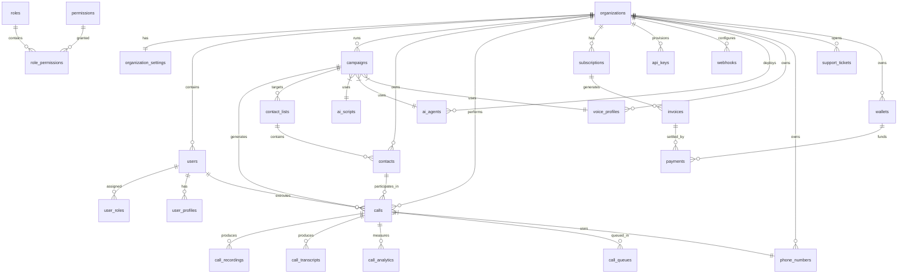

# RDS AI Call Centre — Database Design

**Version:** 1.0.0  
**Database:** PostgreSQL 16+ (Supabase compatible)  
**Author:** Kilo Architect  
**Date:** 2026-07-03

---

## 1. Design Principles

- **Supabase-first:** Uses UUIDs, leverages Supabase Auth, Realtime, and Storage.
- **Multi-tenant by schema:** All operational tables carry `organization_id` and are isolated via RLS.
- **Audit-first:** System writes to append-only `audit_logs` and `activity_logs` for every sensitive action.
- **Soft deletes:** Permanent deletes are rare; data is flagged `deleted_at` and retained.
- **Normalized + denormalized cache:** Operational data normalized; frequent reads use materialized patterns or JSONB caches where latency matters.
- **Extensible:** `settings`/`metadata` use `jsonb` to avoid schema churn for white-label and future features.

---

## 2. ER Diagram



### Diagram Notes
- Entities ending with `_settings`, `_metadata`, or `notes` use `jsonb`.
- All operational tables include `organization_id` for row-level tenancy.
- `audit_logs` is a high-volume append-only table partitioned by month in production.

---

## 3. Schema Reference

### 3.1 Multi-tenancy & Auth

#### organizations
White-label orgs; each org can customize branding and domain.

| Column | Type | Nullable | Default | Notes |
|--------|------|----------|---------|-------|
| id | uuid | NO | gen_random_uuid() | PK |
| name | text | NO | | Display name |
| slug | text | NO | unique | URL-safe identifier |
| plan | text | NO | 'starter' | starter/growth/enterprise |
| status | text | NO | 'active' | active/suspended/trial |
| branding | jsonb | YES | '{}' | Logo, colors, custom domain |
| owner_id | uuid | NO | | FK to users.id |
| timezone | text | YES | 'UTC' | Org default timezone |
| locale | text | YES | 'en-US' | Locale preference |
| metadata | jsonb | YES | '{}' | Extensible org-level data |
| created_at | timestamptz | NO | now() | |
| updated_at | timestamptz | NO | now() | |
| deleted_at | timestamptz | YES | | Soft delete |

#### organization_settings
Granular feature flags, limits, and defaults per org.

| Column | Type | Nullable |
|--------|------|----------|
| id | uuid | NO |
| organization_id | uuid | NO |
| max_concurrent_calls | int | NO |
| max_agents | int | NO |
| call_recording_enabled | boolean | NO |
| ai_tts_voice_id | text | YES |
| ai_stt_provider | text | YES |
| default_caller_id | text | YES |
| ai_greeting | text | YES |
| ai_fallback_message | text | YES |
| compliance_dnd_check | boolean | NO |
| compliance_consent_required | boolean | NO |
| created_at | timestamptz | NO |
| updated_at | timestamptz | NO |

#### users
Core user identity; ties to Supabase Auth via `auth_user_id`.

| Column | Type | Nullable |
|--------|------|----------|
| id | uuid | NO |
| auth_user_id | uuid | NO, unique | FK to auth.users.id |
| email | text | NO, unique |
| phone | text | YES |
| full_name | text | NO |
| avatar_url | text | YES |
| status | text | NO | active/invited/suspended |
| last_login_at | timestamptz | YES |
| created_at | timestamptz | NO |
| updated_at | timestamptz | NO |
| deleted_at | timestamptz | YES |

#### user_profiles
Extended user preferences.

| Column | Type | Nullable |
|--------|------|----------|
| id | uuid | NO |
| user_id | uuid | NO |
| notification_prefs | jsonb | YES, '{}' |
| ui_preferences | jsonb | YES, '{}' |
| created_at | timestamptz | NO |
| updated_at | timestamptz | NO |

#### roles
System and custom roles.

| Column | Type | Nullable |
|--------|------|----------|
| id | uuid | NO |
| organization_id | uuid | YES | Null = system role |
| name | text | NO |
| description | text | YES |
| is_system | boolean | NO | false |
| created_at | timestamptz | NO |
| updated_at | timestamptz | NO |

#### permissions
Atomic permissions.

| Column | Type | Nullable |
|--------|------|----------|
| id | uuid | NO |
| key | text | NO, unique | e.g., calls.create |
| description | text | YES |
| created_at | timestamptz | NO |

#### role_permissions
Role-to-permission mapping.

| Column | Type | Nullable |
|--------|------|----------|
| id | uuid | NO |
| role_id | uuid | NO |
| permission_id | uuid | NO |
| created_at | timestamptz | NO |

#### user_roles
Assigns roles to users within an org.

| Column | Type | Nullable |
|--------|------|----------|
| id | uuid | NO |
| user_id | uuid | NO |
| role_id | uuid | NO |
| organization_id | uuid | NO |
| created_at | timestamptz | NO |
| assigned_by | uuid | YES | FK users.id |

### 3.2 AI & Call Center

#### ai_agents
Voice AI agent configurations.

| Column | Type | Nullable |
|--------|------|----------|
| id | uuid | NO |
| organization_id | uuid | NO |
| name | text | NO |
| description | text | YES |
| system_prompt | text | NO |
| llm_provider | text | NO | openai/anthropic/local |
| llm_model | text | NO | |
| tts_provider | text | NO |
| tts_voice_id | text | NO |
| stt_provider | text | NO |
| stt_model | text | NO |
| temperature | numeric | NO | 0.7 |
| max_tokens | int | NO | 256 |
| stop_sequences | jsonb | YES, '[]' |
| metadata | jsonb | YES, '{}' |
| created_at | timestamptz | NO |
| updated_at | timestamptz | NO |
| deleted_at | timestamptz | YES |

#### ai_scripts
Conversation flow scripts / prompts.

| Column | Type | Nullable |
|--------|------|----------|
| id | uuid | NO |
| organization_id | uuid | NO |
| name | text | NO |
| description | text | YES |
| script_schema | jsonb | NO | Nodes/edges for flow builder |
| content | jsonb | NO | Prompt templates/variables |
| version | int | NO | 1 |
| is_published | boolean | NO | false |
| created_by | uuid | NO | FK users.id |
| created_at | timestamptz | NO |
| updated_at | timestamptz | NO |
| deleted_at | timestamptz | YES |

#### voice_profiles
TTS voice presets.

| Column | Type | Nullable |
|--------|------|----------|
| id | uuid | NO |
| organization_id | uuid | NO |
| name | text | NO |
| provider | text | NO | elevenlabs/polly/google |
| voice_id | text | NO |
| language | text | NO | en-US |
| gender | text | YES | male/female/neutral |
| speed | numeric | NO | 1.0 |
| pitch | numeric | YES | 0 |
| metadata | jsonb | YES, '{}' |
| created_at | timestamptz | NO |
| updated_at | timestamptz | NO |

#### phone_numbers
Org-owned phone numbers (Twilio/Exotel/Plivo).

| Column | Type | Nullable |
|--------|------|----------|
| id | uuid | NO |
| organization_id | uuid | NO |
| number | text | NO | E.164 format |
| country | text | NO | US/IN/GB... |
| provider | text | NO | twilio/exotel/... |
| provider_sid | text | YES | Provider identifier |
| capabilities | jsonb | YES, '{}' | voice/sms/fax |
| status | text | NO | active/inactive |
| monthly_cost | numeric | YES | |
| purchased_at | timestamptz | YES |
| created_at | timestamptz | NO |
| updated_at | timestamptz | NO |

#### contact_lists
CSV/imported contact groups.

| Column | Type | Nullable |
|--------|------|----------|
| id | uuid | NO |
| organization_id | uuid | NO |
| name | text | NO |
| description | text | YES |
| total_contacts | int | NO | 0 |
| tags | text[] | YES | '{}' |
| created_by | uuid | NO | FK users.id |
| created_at | timestamptz | NO |
| updated_at | timestamptz | NO |
| deleted_at | timestamptz | YES |

#### contacts
Individuals to call.

| Column | Type | Nullable |
|--------|------|----------|
| id | uuid | NO |
| organization_id | uuid | NO |
| contact_list_id | uuid | YES | FK contact_lists.id |
| first_name | text | YES |
| last_name | text | YES |
| email | text | YES |
| phone | text | NO | E.164 |
| country | text | YES |
| timezone | text | YES |
| metadata | jsonb | YES, '{}' | Custom fields |
| tags | text[] | YES | '{}' |
| dnd_status | boolean | NO | false |
| source | text | YES | csv/api/... |
| created_at | timestamptz | NO |
| updated_at | timestamptz | NO |
| deleted_at | timestamptz | YES |

#### campaigns
Outbound/inbound campaign definitions.

| Column | Type | Nullable |
|--------|------|----------|
| id | uuid | NO |
| organization_id | uuid | NO |
| name | text | NO |
| description | text | YES |
| type | text | NO | outbound/inbound |
| status | text | NO | draft/scheduled/running/paused/ended |
| direction | text | NO | outbound/inbound |
| ai_agent_id | uuid | YES | FK ai_agents.id |
| ai_script_id | uuid | YES | FK ai_scripts.id |
| voice_profile_id | uuid | YES | FK voice_profiles.id |
| from_number_id | uuid | YES | FK phone_numbers.id |
| contact_list_id | uuid | YES | FK contact_lists.id |
| schedule | jsonb | YES, '{}' | Cron/timezone/dates |
| retry_policy | jsonb | YES, '{}' | Max retries, intervals |
| dialing_strategy | text | YES | progressive/predictive/power |
| max_concurrent | int | YES | |
| total_contacts | int | NO | 0 |
| completed_contacts | int | NO | 0 |
| failed_contacts | int | NO | 0 |
| started_at | timestamptz | YES |
| ended_at | timestamptz | YES |
| created_by | uuid | NO | FK users.id |
| created_at | timestamptz | NO |
| updated_at | timestamptz | NO |
| deleted_at | timestamptz | YES |

#### calls
Individual call records.

| Column | Type | Nullable |
|--------|------|----------|
| id | uuid | NO |
| organization_id | uuid | NO |
| campaign_id | uuid | YES | FK campaigns.id |
| contact_id | uuid | YES | FK contacts.id |
| agent_id | uuid | YES | FK ai_agents.id |
| from_number_id | uuid | YES | FK phone_numbers.id |
| call_queue_id | uuid | YES | FK call_queues.id |
| direction | text | NO | outbound/inbound |
| status | text | NO | queued/ringing/connected/ended/failed/no-answer/busy |
| outcome | text | YES | completed/human/voicemail/machine/busy/no-answer/failed |
| provider | text | YES | twilio/exotel/... |
| provider_call_sid | text | YES | |
| to_number | text | NO | E.164 |
| from_number | text | NO | E.164 |
| duration_seconds | int | NO | 0 |
| bill_seconds | int | NO | 0 |
| recording_url | text | YES | |
| recording_duration | int | YES | |
| cost | numeric | YES | |
| currency | text | YES | USD |
| dial_attempt | int | NO | 1 |
| start_at | timestamptz | YES |
| answer_at | timestamptz | YES |
| end_at | timestamptz | YES |
| hangup_cause | text | YES | |
| metadata | jsonb | YES, '{}' |
| created_at | timestamptz | NO |
| updated_at | timestamptz | NO |
| deleted_at | timestamptz | YES |

#### call_queues
Queues for inbound/human-agent call distribution.

| Column | Type | Nullable |
|--------|------|----------|
| id | uuid | NO |
| organization_id | uuid | NO |
| name | text | NO |
| strategy | text | NO | fifo/priority/round-robin |
| max_wait_seconds | int | YES | |
| overflow_action | text | YES | voicemail/callback/end |
| agent_ids | uuid[] | YES | '{}' |
| created_at | timestamptz | NO |
| updated_at | timestamptz | NO |

#### call_recordings
Per-call recording metadata.

| Column | Type | Nullable |
|--------|------|----------|
| id | uuid | NO |
| call_id | uuid | NO |
| organization_id | uuid | NO |
| url | text | NO | |
| provider | text | YES | |
| provider_recording_sid | text | YES | |
| format | text | YES | mp3/wav |
| size_bytes | bigint | YES | |
| duration_seconds | int | YES | |
| channels | int | YES | |
| encryption_key_id | text | YES | |
| created_at | timestamptz | NO |
| updated_at | timestamptz | NO |

#### call_transcripts
Chunked transcripts per call.

| Column | Type | Nullable |
|--------|------|----------|
| id | uuid | NO |
| call_id | uuid | NO |
| organization_id | uuid | NO |
| channel | text | NO | customer/agent/system |
| sequence | int | NO | Order within call |
| text | text | NO | |
| confidence | numeric | YES | |
| is_final | boolean | NO | false |
| words | jsonb | YES, '[]' | Word-level timestamps |
| created_at | timestamptz | NO |
| updated_at | timestamptz | NO |

#### call_analytics
Aggregated measurements per call.

| Column | Type | Nullable |
|--------|------|----------|
| id | uuid | NO |
| call_id | uuid | NO |
| organization_id | uuid | NO |
| sentiment | text | YES | positive/neutral/negative |
| sentiment_score | numeric | YES | -1..1 |
| intent | text | YES | |
| entities | jsonb | YES, '[]' | Named entities |
| keywords | text[] | YES | '{}' |
| talk_ratio_customer | numeric | YES | |
| talk_ratio_agent | numeric | YES | |
| silence_seconds | int | YES | |
| ai_turns | int | YES | 0 |
| human_turns | int | YES | |
| wrap_up_code | text | YES | |
| csat_score | int | YES | 1-5 |
| created_at | timestamptz | NO |
| updated_at | timestamptz | NO |

### 3.3 Integrations & Webhooks

#### api_keys
Org-scoped API keys.

| Column | Type | Nullable |
|--------|------|----------|
| id | uuid | NO |
| organization_id | uuid | NO |
| user_id | uuid | NO | FK users.id |
| name | text | NO |
| key_prefix | text | NO | First 8 chars |
| key_hash | text | NO | bcrypt/scrypt |
| last_used_at | timestamptz | YES |
| expires_at | timestamptz | YES |
| created_at | timestamptz | NO |
| updated_at | timestamptz | NO |
| deleted_at | timestamptz | YES |

#### integrations
External service props.

| Column | Type | Nullable |
|--------|------|----------|
| id | uuid | NO |
| organization_id | uuid | NO |
| provider | text | NO | twilio/exotel/zendesk/... |
| name | text | NO |
| status | text | NO | active/inactive/error |
| config | jsonb | YES, '{}' | Encrypted credentials |
| webhook_url | text | YES | |
| created_by | uuid | NO | FK users.id |
| created_at | timestamptz | NO |
| updated_at | timestamptz | NO |
| deleted_at | timestamptz | YES |

#### webhooks
Org webhook endpoints.

| Column | Type | Nullable |
|--------|------|----------|
| id | uuid | NO |
| organization_id | uuid | NO |
| url | text | NO |
| secret | text | NO | HMAC secret |
| events | text[] | NO | call.ended, call.recording.completed, ... |
| is_active | boolean | NO | true |
| created_at | timestamptz | NO |
| updated_at | timestamptz | NO |
| deleted_at | timestamptz | YES |

#### webhook_deliveries
Delivery attempts log.

| Column | Type | Nullable |
|--------|------|----------|
| id | uuid | NO |
| webhook_id | uuid | NO |
| organization_id | uuid | NO |
| event | text | NO |
| payload | jsonb | NO | |
| status | text | NO | pending/success/failed |
| http_status | int | YES | |
| response_body | text | YES | |
| attempt | int | NO | 1 |
| next_attempt_at | timestamptz | YES | |
| created_at | timestamptz | NO |
| updated_at | timestamptz | NO |

### 3.4 Billing & Usage

#### subscriptions

| Column | Type | Nullable |
|--------|------|----------|
| id | uuid | NO |
| organization_id | uuid | NO, unique |
| plan | text | NO | starter/growth/enterprise |
| status | text | NO | active/trialing/past_due/canceled |
| current_period_start | timestamptz | NO |
| current_period_end | timestamptz | NO |
| trial_ends_at | timestamptz | YES |
| cancel_at_period_end | boolean | NO | false |
| canceled_at | timestamptz | YES |
| metadata | jsonb | YES, '{}' |
| created_at | timestamptz | NO |
| updated_at | timestamptz | NO |

#### invoices

| Column | Type | Nullable |
|--------|------|----------|
| id | uuid | NO |
| organization_id | uuid | NO |
| subscription_id | uuid | YES | |
| amount | numeric | NO | |
| currency | text | NO | USD |
| status | text | NO | draft/open/paid/void |
| due_at | timestamptz | YES | |
| paid_at | timestamptz | YES | |
| line_items | jsonb | YES, '[]' | |
| created_at | timestamptz | NO |
| updated_at | timestamptz | NO |

#### payments

| Column | Type | Nullable |
|--------|------|----------|
| id | uuid | NO |
| organization_id | uuid | NO |
| invoice_id | uuid | YES | |
| amount | numeric | NO | |
| currency | text | NO | USD |
| method | text | NO | card/paypal/... |
| provider_payment_id | text | YES | |
| status | text | NO | succeeded/failed/pending |
| failure_reason | text | YES | |
| processed_at | timestamptz | YES |
| created_at | timestamptz | NO |

#### wallets

| Column | Type | Nullable |
|--------|------|----------|
| id | uuid | NO |
| organization_id | uuid | NO, unique |
| balance | numeric | NO | 0 |
| currency | text | NO | USD |
| created_at | timestamptz | NO |
| updated_at | timestamptz | NO |

#### usage_records
Daily usage per organization for metering.

| Column | Type | Nullable |
|--------|------|----------|
| id | uuid | NO |
| organization_id | uuid | NO |
| record_date | date | NO | |
| ai_minutes | numeric | NO | 0 |
| telephony_minutes | numeric | NO | 0 |
| calls_count | int | NO | 0 |
| storage_bytes | bigint | NO | 0 |
| stt_minutes | numeric | NO | 0 |
| tts_characters | int | NO | 0 |
| created_at | timestamptz | NO |
| updated_at | timestamptz | NO |

### 3.5 System & Support

#### notifications

| Column | Type | Nullable |
|--------|------|----------|
| id | uuid | NO |
| organization_id | uuid | NO |
| user_id | uuid | YES | FK users.id |
| type | text | NO | email/sms/push/in-app |
| channel | text | NO | billing/usage/security/support |
| title | text | NO |
| body | text | YES | |
| data | jsonb | YES, '{}' |
| read_at | timestamptz | YES |
| created_at | timestamptz | NO |

#### support_tickets

| Column | Type | Nullable |
|--------|------|----------|
| id | uuid | NO |
| organization_id | uuid | NO |
| user_id | uuid | YES | FK users.id |
| subject | text | NO |
| description | text | YES | |
| status | text | NO | open/in_progress/resolved/closed |
| priority | text | NO | low/normal/high/critical |
| assignee_id | uuid | YES | FK users.id |
| created_at | timestamptz | NO |
| updated_at | timestamptz | NO |
| closed_at | timestamptz | YES |

#### activity_logs
Internal operational events.

| Column | Type | Nullable |
|--------|------|----------|
| id | uuid | NO |
| organization_id | uuid | NO |
| user_id | uuid | YES | FK users.id |
| action | text | NO | campaign.created, call.ended, ... |
| target_type | text | NO | campaign, call, ... |
| target_id | uuid | YES | |
| ip_address | text | YES | |
| user_agent | text | YES | |
| metadata | jsonb | YES, '{}' |
| created_at | timestamptz | NO |

#### audit_logs
Append-only security-sensitive audit trail.

| Column | Type | Nullable |
|--------|------|----------|
| id | uuid | NO |
| organization_id | uuid | NO |
| actor_id | uuid | YES | FK users.id |
| action | text | NO | auth.login, permission.changed, ... |
| actor_type | text | NO | user/system/api |
| resource_type | text | NO | |
| resource_id | uuid | YES | |
| ip_address | text | YES | |
| user_agent | text | YES | |
| before | jsonb | YES | Previous state |
| after | jsonb | YES | New state |
| created_at | timestamptz | NO |

#### system_settings
Global system configuration.

| Column | Type | Nullable |
|--------|------|----------|
| id | uuid | NO |
| key | text | NO, unique |
| value | jsonb | NO | |
| description | text | YES | |
| created_at | timestamptz | NO |
| updated_at | timestamptz | NO |

#### knowledge_base
RAG-style knowledge base per org/agent.

| Column | Type | Nullable |
|--------|------|----------|
| id | uuid | NO |
| organization_id | uuid | NO |
| ai_agent_id | uuid | YES | |
| title | text | NO |
| content | text | NO |
| embedding | vector(1536) | YES | OpenAI text-embedding-3-small |
| tags | text[] | YES | '{}' |
| created_by | uuid | NO | FK users.id |
| created_at | timestamptz | NO |
| updated_at | timestamptz | NO |
| deleted_at | timestamptz | YES |

---

## 4. Row Level Security (RLS)

All operational tables are org-scoped. RLS policies enforce that:
- Supabase Auth users can only read/write within their `organization_id`.
- Service role bypasses RLS for server-side jobs.
- Anonymous access is denied everywhere.

### Example Policy
```sql
CREATE POLICY org_isolation ON calls
  FOR ALL
  USING (
    organization_id = (
      SELECT users.organization_id
      FROM users
      WHERE users.auth_user_id = auth.uid()
    )
  );
```

Full policies are generated in `database/migrations/002_rls_policies.sql`.

---

## 5. Index Strategy

### Operational Indexes
- `btree` on `organization_id` for every tenant-scoped table.
- `btree` on `campaign_id`, `contact_id`, `call_queue_id` for analytics joins.
- `btree` on `created_at` for cron/backfill jobs.
- `btree` on `status` and `outcome` for filtering.
- `btree` on `auth_user_id`, `email` in `users` for auth lookups.

### Search Indexes
- `GIN` on `contacts.metadata` and `campaigns.schedule` for JSONB queries.
- `GIN` on `notifications.data`, `integrations.config`.
- `GIN` on `knowledge_base.tags`.
- `GIN` on `webhook_deliveries.payload` for debugging.
- `GIN` on `activity_logs.metadata`, `audit_logs.before/after`.

### Vector Indexes
- `ivfflat` on `knowledge_base.embedding` for semantic search.

### Realtime
All candidate tables include `REPLICA IDENTITY FULL` for row-level change replication.

---

## 6. Triggers & Functions

### Auto-timestamps
- `set_updated_at()` trigger on all tables with `updated_at`.

### Soft Deletes
- `soft_delete()` trigger prevents accidental hard deletes.
- Business logic checks `deleted_at IS NULL` everywhere.

### Audit Logging
- `audit_trigger()` fires on INSERT/UPDATE/DELETE for high-sensitivity tables (organizations, users, campaigns, calls, api_keys, integrations, webhooks).

### Usage Aggregation
- `increment_usage_record()` updates daily `usage_records` atomically.

### Cleanup
- `purge_old_logs()` removeslogs older than retention window (e.g., 90 days).

---

## 7. Views

- `v_active_calls` — current live call summary (60s stale grace).
- `v_campaign_summary` — campaign completion stats.
- `v_org_usage_daily` — per-org daily metering.
- `v_audit_trail` — readable audit timeline with actor names.

---

## 8. Sequences / Enumerations

PostgreSQL `CHECK` constraints define enums to avoid custom types:
- plan, status, outcome, direction, provider, channel, priority, action

---

## 9. Supabase Compatibility Notes

- All tables use `gen_random_uuid()` as PK.
- `auth_user_id` in `users` maps to `auth.users.id`.
- RLS policies reference `auth.uid()`.
- Storage objects use `organization_id` in path prefixes: `org/<org_id>/recordings/...`.
- Realtime publication covers all tables marked for Realtime.

---

## 10. Data Retention

- Calls and related entities: 13 months by default.
- Logs (`activity_logs`, `audit_logs`): 90 days hot, 1 year cold.
- Recordings: encrypted S3/MinIO with lifecycle policy.
- Participants can request deletion via support ticket per privacy law.

---

*Last updated: 2026-07-03 by Kilo Architect*
